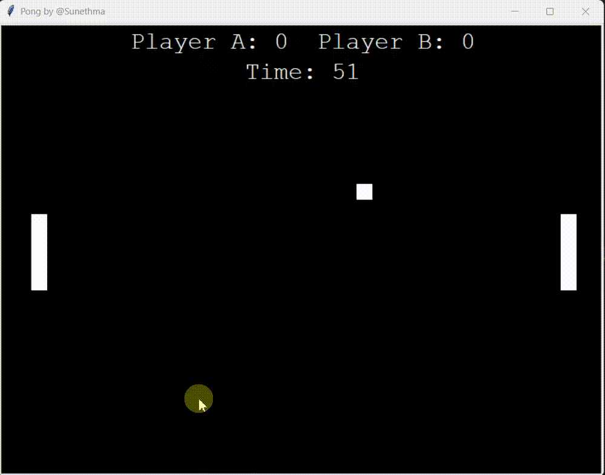

# Pong Game 🏓

A classic Pong game implementation using Python and Turtle graphics.




## Features

- Two-player gameplay
- 60-second timed matches
- Score tracking
- Sound effects on ball collisions
- Boundary detection and paddle collision physics

## Requirements

- Python 3.x
- `turtle` module (included with Python)
- `winsound` module (Windows only)
- `bounce.wav` sound file in the same directory

## How to Play

1. Run the game:
```bash
   python pong.py
```

2. Controls:
   - **Player A (Left)**: `W` (up) / `S` (down)
   - **Player B (Right)**: `↑` (up) / `↓` (down)

3. The game runs for 60 seconds. The player with the highest score wins!

## Game Rules

- Score points by hitting the ball with your paddle
- The ball bounces off the top and bottom walls
- If the ball goes past a paddle, it resets to the center
- Game ends when the timer reaches zero

## Note

This game uses `winsound` which is Windows-specific. For other operating systems, you'll need to modify the sound playback functionality.

---

Made by Sunethma
